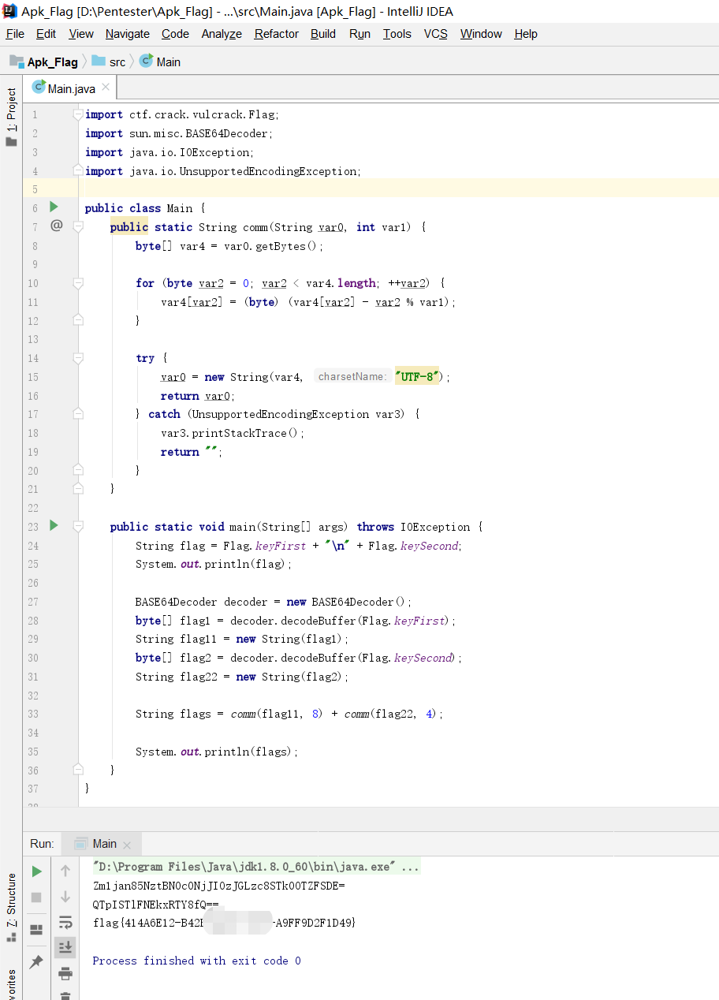

## 记一道apk 脱壳

## 0x00 测试环境

```
windows 安装frida 和 frida-tools objection

pip install frida
pip install frida-tools
pip install objection

一台root过的安卓设备机器，安卓版本：8.1.0
```

## 0x01 安装apk

`apk install vulcrack.apk`

## 0x02 上传frida-server 至 安卓设备

创建目录 `/data/local/jas502n`

```
C:\Users\CTF>adb shell
sailfish:/ # id
id
uid=0(root) gid=0(root) groups=0(root),1004(input),1007(log),1011(adb),1015(sdcard_rw),1028(sdcard_r),3001(net_bt_admin),3002(net_bt),3003(inet),3006(net_bw_stats),3009(readproc),3011(uhid) context=u:r:su:s0
sailfish:/ # mkdir /data/local/jas502n
mkdir /data/local/jas502n
sailfish:/ # cd /data/local/jas502n
cd /data/local/jas502n
sailfish:/data/local/jas502n # ls
ls
sailfish:/data/local/jas502n #
````

上传frida-server 至 `/data/local/jas502n`

`adb push frida-server /data/local/jas502n`

```
C:\Users\CTF\Desktop\FRIDA-DEXDump-master>adb push frida-server /data/local/jas502n
1766 KB/s (40670824 bytes in 22.478s)
```
## 0x03 安卓设备上 运行frida-server 

`chmod a+x frida-server`
`./frida-server`

```
C:\Users\CTF\Desktop\FRIDA-DEXDump-master>adb shell
sailfish:/ # cd /data/local/jas502n
cd /data/local/jas502n
sailfish:/data/local/jas502n # ls
ls
frida-server
sailfish:/data/local/jas502n # ls -lah
ls -lah
total 19M
drwxrwxrwx 2 root root 4.0K 2020-05-27 10:48 .
drwxr-x--x 5 root root 4.0K 2020-05-27 10:46 ..
-rw-rw-rw- 1 root root  39M 2020-05-26 15:17 frida-server
sailfish:/data/local/jas502n # chmod a+x frida-server
sailfish:/data/local/jas502n # ./frida-server
./frida-server
```
## 0x04 启动要脱壳的app

例如： `vulcrack.apk`

查看app 包名： `frida-ps -U |findstr vulcrack `


```
C:\Users\CTF>frida-ps -U |findstr vulcrack
3211  ctf.crack.vulcrack
```
## 0x05 运行python脚本开始脱壳

`unable to connect to remote frida-server `

```
python3 main.py

----------------------------------------------------------------------------------------
  ____________ ___________  ___        ______ _______   _______
  |  ___| ___ \_   _|  _  \/ _ \       |  _  \  ___\ \ / /  _  \
  | |_  | |_/ / | | | | | / /_\ \______| | | | |__  \ V /| | | |_   _ _ __ ___  _ __
  |  _| |    /  | | | | | |  _  |______| | | |  __| /   \| | | | | | | '_ ` _ \| '_ \
  | |   | |\ \ _| |_| |/ /| | | |      | |/ /| |___/ /^\ \ |/ /| |_| | | | | | | |_) |
  \_|   \_| \_|\___/|___/ \_| |_/      |___/ \____/\/   \/___/  \__,_|_| |_| |_| .__/
                                                                               | |
                                                                               |_|
                      https://github.com/hluwa/FRIDA-DEXDump
----------------------------------------------------------------------------------------
[Except] - Unable to inject into process: unable to connect to remote frida-server in
  File "D:\Python38\lib\site-packages\frida\core.py", line 93, in get_frontmost_application
    return self._impl.get_frontmost_application()
```

查看`frida-server` 端口

```
sailfish:/ # netstat -ntpl
netstat -ntpl
Active Internet connections (only servers)
Proto Recv-Q Send-Q Local Address           Foreign Address         State       PID/Program Name
tcp        0      0 127.0.0.1:5037          0.0.0.0:*               LISTEN      2944/adbd
tcp        0      0 127.0.0.1:27042         0.0.0.0:*               LISTEN      3474/frida-server
tcp6       0      0 :::25552                :::*                    LISTEN      3211/ctf.crack.vulcrack
```

将frida-server端口转发到本地

`adb forward tcp:27042 tcp:27042`

再次尝试运行 python 脚本

`python3 main.py`

```
C:\Users\CTF\.objection\plugins\dexdump>python3 main.py

----------------------------------------------------------------------------------------
  ____________ ___________  ___        ______ _______   _______
  |  ___| ___ \_   _|  _  \/ _ \       |  _  \  ___\ \ / /  _  \
  | |_  | |_/ / | | | | | / /_\ \______| | | | |__  \ V /| | | |_   _ _ __ ___  _ __
  |  _| |    /  | | | | | |  _  |______| | | |  __| /   \| | | | | | | '_ ` _ \| '_ \
  | |   | |\ \ _| |_| |/ /| | | |      | |/ /| |___/ /^\ \ |/ /| |_| | | | | | | |_) |
  \_|   \_| \_|\___/|___/ \_| |_/      |___/ \____/\/   \/___/  \__,_|_| |_| |_| .__/
                                                                               | |
                                                                               |_|
                      https://github.com/hluwa/FRIDA-DEXDump
----------------------------------------------------------------------------------------
05-27/10:35:52 INFO [DEXDump]: found target [3211] ctf.crack.vulcrack
su: invalid uid/gid '-c'
[DEXDump]: DexSize=0xbccec, DexMd5=44dcd030fa3d92f37230f00779013591, SavePath=C:\Users\CTF\.objection\plugins\dexdump/ctf.crack.vulcrack/0x74fd239000.dex
[DEXDump]: DexSize=0x20c428, DexMd5=0e5e4423ca8c5376166ddada4caa73b6, SavePath=C:\Users\CTF\.objection\plugins\dexdump/ctf.crack.vulcrack/0x74fd2f6000.dex
[DEXDump]: DexSize=0x20c428, DexMd5=75c8a781f3b5dd9bbda996113776ad6b, SavePath=C:\Users\CTF\.objection\plugins\dexdump/ctf.crack.vulcrack/0x74fd7aa540.dex
[DEXDump]: Skip duplicate dex 0x74fd8ae3c0<44dcd030fa3d92f37230f00779013591>
[DEXDump]: DexSize=0x11c, DexMd5=f1771b68f5f9b168b79ff59ae2daabe4, SavePath=C:\Users\CTF\.objection\plugins\dexdump/ctf.crack.vulcrack/0x74fdb92065.dex
[DEXDump]: Skip duplicate dex 0x74fddfc01c<44dcd030fa3d92f37230f00779013591>

C:\Users\CTF\.objection\plugins\dexdump>

```

## 0x06 查找需要的dex,基于MainActivity

脱出来共4个dex

`ls -lah ctf.crack.vulcrack`

```
C:\Users\CTF\.objection\plugins\dexdump>ls -lah ctf.crack.vulcrack
total 4.9M
drwxr-xr-x 1 CTF 197121    0 May 27 10:36 .
drwxr-xr-x 1 CTF 197121    0 May 27 10:36 ..
-rw-r--r-- 1 CTF 197121 756K May 27 10:36 0x74fd239000.dex
-rw-r--r-- 1 CTF 197121 2.1M May 27 10:36 0x74fd2f6000.dex
-rw-r--r-- 1 CTF 197121 2.1M May 27 10:36 0x74fd7aa540.dex
-rw-r--r-- 1 CTF 197121  284 May 27 10:36 0x74fdb92065.dex
```
查找存在MainActivity的dex

`grep -r 'MainActivity' -n ./ctf.crack.vulcrack`

```
C:\Users\CTF\.objection\plugins\dexdump>grep -r 'MainActivity' -n ./ctf.crack.vulcrack
Binary file ./ctf.crack.vulcrack/0x74fd2f6000.dex matches
```




# FRIDA-DEXDump

[Chinese WriteUp](https://mp.weixin.qq.com/s/x8_aa762wpsvA4nhSLoppQ)

Fast search and dump dex on memory.

## Features
1. support fuzzy search no-magic dex.
2. auto fill magic into dex-header.
3. compatible with all android version(frida supported).
4. support loading as objection plugin~

## Usage
1. update your frida-server and frida python binding to latest.
2. install require: `pip install -r requirements.txt`
3. launch app.
4. run: python main.py.
5. check `SavePath`.

### objection plugin

1. clone this repo to your plugins folder, eg:
    > git clone https://github.com/hluwa/FRIDA-DEXDump ~/.objection/plugins/dexdump
2. start objection with `-P` or `--plugin-folder` your plugins folder, eg:
    > objection -g com.app.name explore -P ~/.objection/plugins
3. run command:
    1. ` plugin dexdump search ` to search and print all dex
    2. ` plugin dexdump dump ` to dump all found dex.

## Screenshot


